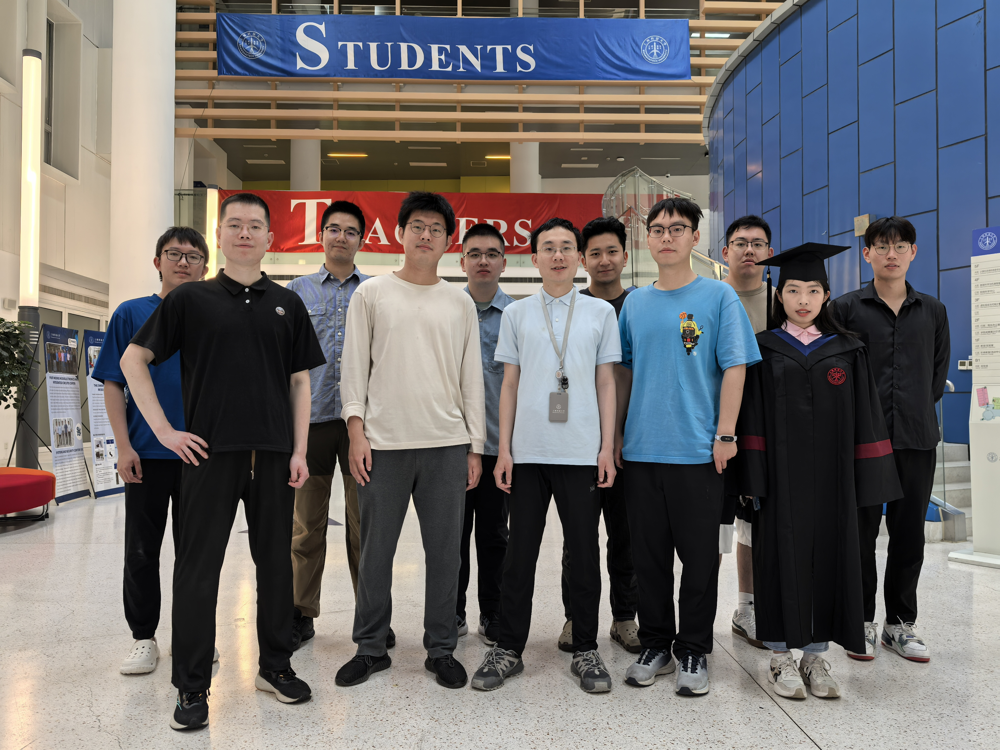
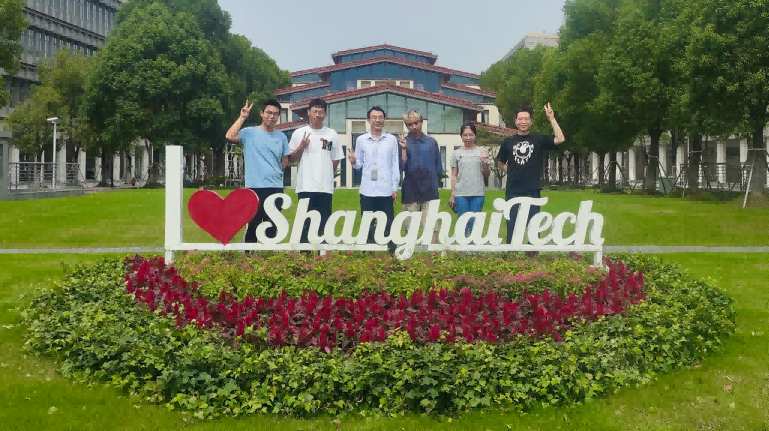

---
---
Welcome to the Robot Interaction and Manipulation Lab! Our mission is to develop tactile sensing capabilities for humanoid robots.

**Openings:** 
- [Master Program] Our lab has 2-3 **Master program** student openings every year: 2025 保研推免，含报名中的夏令营([夏令营招生简章](https://sist.shanghaitech.edu.cn/2024/0513/c2863a1096341/page.htm)、[报名入口](https://gadmission.shanghaitech.edu.cn/enroll_student/))、统考. Feel free to shot me an email (xiaochx AT shanghaitech.edu.cn) or fill information [应聘 APPLY](https://l1l6pvkmmmw.feishu.cn/share/base/form/shrcnSqulK34HeHeSwWuzwVkxMd){: .button}.
- [PhD program] We are collaborating with BIGAI (北京通用人工智能研究院) to admit 2025 PhD students, focusing on robot manipulation, teleoperation, and related areas. 推免直博夏令营报名中：[通计划夏令营](https://mp.weixin.qq.com/s/PgF59X2Gijm5d1-fRyTdbQ). 需要同时报名上科大夏令营。
- [RA & PostDoc] Our lab has 2 openings for full-time **Research Assistant** and **Research Assistant Professor (or PostDoc)** [应聘 APPLY](https://l1l6pvkmmmw.feishu.cn/share/base/form/shrcnSqulK34HeHeSwWuzwVkxMd){: .button}.

<!-- -  We have a 2024 **joint PhD position** available with BIGAI (北京通用人工智能研究院), focusing on robot manipulation, teleoperation, and related areas (application deadline: May 29 2024). Feel free to contact us by email.  For application details, please refer to
  [Guidelines (上科大研招信息)](https://yanzhao.shanghaitech.edu.cn/2024/0428/c2420a1094332/page.htm)   -->

---

Our research interests include but are not limited to:

🖐️ **Tactile sensors**. We develop tactile sensors for dexterous hands.

🧠 **Learning manipulation skills**. We enable robot to learn object manipulation skills through tactile sensing. 

🌐 **Human-robot interaction**. We explore techniques (e.g., teleoperation) that help robots collaborate with human. 

## 2024

  

## 2023

  

